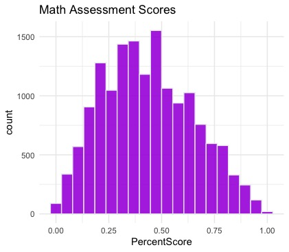
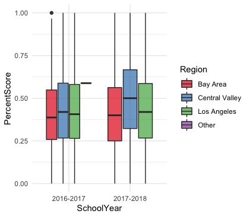
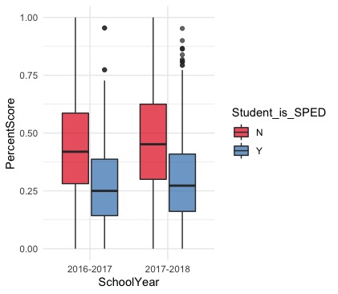

# Charter-School-Data-Dive
This is an exploratory analysis of an unnamed charter school system. It was originally assigned to me on 8/1/2020. 
The goal of this project was to understand how different students performed on an interim math assessment in 2016 and 2017.

I'm hoping to understand which types of students demonstrated proficiency, and also which grade levels and school sites demonstrated proficiency. 
Additionally, I'm hoping to discover a relationship between prior school performance and overall growth. 

My analysis will progress as followed:

## Dataset Scrub
* Ensure student data is HIPAA compliant 
* Check for inconsistencies with student IDs 
* Eliminate observations of groups with sample size <10
* Rename columns for easier reading

## Visualizations of Data
* Histograms to understand score proficiencies 
* Categorized Bar Graphs 
  
## Multivariate Regression
* Understand which categorical variables contribute to academic proficiency
  
## Exploration
Load required libraries
```
library(readxl)
library(ggplot2)
library(dplyr)
library(dummies)
library(data.frame)
```
### Data Restructure
First we convert all necessary columns to factor variables, so they can later be analyzed as categories

```
cols<-c("SchoolYear", "Student_Grade_Level", "School","Region", 
        "AssessmentType", "AssessmentSubject", 
        "AssessmentName", "Student_Ethnicity", 
        "Student_is_FreeOrReducedLunch", "Language_Fluency",
        "Student_is_SPED", "ProficiencyLevelScore") 
hw[,cols] <- lapply(hw[,cols], as.factor) #Convert necessary columns to factors
```

We are only interesed in students in grades 8-11, so we will remove grade 12 observations from the dataset when testing yearly improvement. We can also remove Memphis students from our dataset, as their is only one observation. 

Additionally, I want to remove any observations with missing data.
```
hw <- subset(hw, hw$Region!="Memphis") #Remove Memphis, only one observation, not significant
hw <- subset(hw, hw$Language_Fluency!="-----") 
hw <- subset(hw, hw$Student_Ethnicity!="-----") 
hw <- subset(hw, Student_Grade_Level != "12")
hw2016 <- subset(hw, hw$SchoolYear != '2016-2017') 
hw2017 <- subset(hw, SchoolYear != '2017-2018') 
```
Doing an initial data visualization, Math asssessment scores are pretty much normally distributed, with an average of 48% 

  

Additionally, when breaking out assessment scores by region, we see that The Bay Area averages the lowest scores both years, while the Central Valley averages significantly higher scores than the other regions both years.

 
